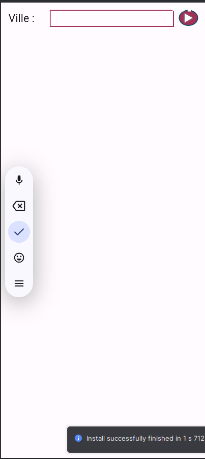
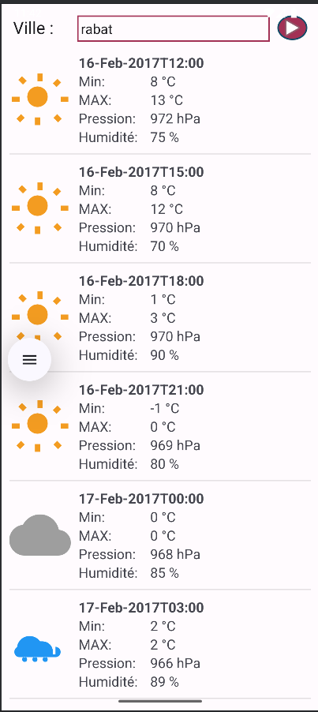

# 🌤️ Activité Pratique : Application Mobile de Prévisions Météo avec OpenWeatherMap

Ce dépôt contient la solution de l’activité pratique consistant à développer une **application mobile Android** permettant de consulter les prévisions météorologiques d’une ville donnée, en utilisant l’API REST publique de **OpenWeatherMap**.  
Ce TP est réalisé dans le cadre du cours de **Développement Mobile Android** dispensé par **Mr JAMAL MAWANE**.

---

## 🎯 Objectif

L’objectif de ce TP est de créer une application Android fonctionnelle qui permet à l’utilisateur de :

1. **Saisir le nom d’une ville**
2. **Afficher les prévisions météo** de cette ville en utilisant l’API REST de [openweathermap.org](https://openweathermap.org)

Pour chaque prévision, les informations suivantes sont affichées :

- 📅 **Date et heure**
- 🌡️ **Température maximale**
- 🌡️ **Température minimale**
- 🌬️ **Pression atmosphérique**
- 💧 **Humidité**
- 🌈 **État du ciel** (ex. : Clear, Clouds, Rain, Snow)

---

## 🔌 API utilisée

L'application interagit avec l'API [OpenWeatherMap](https://openweathermap.org/api) pour récupérer les données météo au format **JSON** via des requêtes HTTP.

---

## ⚙️ Technologies utilisées

- 📱 Android Studio (Java / Kotlin)
- 🌐 Requêtes HTTP via **Volley**
- 🎨 Interface utilisateur en XML
- 📦 Parsing JSON avec GSON ou JSONObject
- 🧪 Tests sur **émulateur Android** 

---

## 📂 Structure du Projet

weather-forecast-app/  
├── app/  
│   ├── src/  
│   │   └── main/  
│   │       ├── java/  
│   │       │   └── com.ouss.weather/  
│   │       │       ├── MainActivity.kt  
│   │       │       ├── MeteoItem.kt  
│   │       │       └── MeteoListModel.kt  
│   │       └── res/  
│   │           ├── layout/  
│   │           ├── drawable/  
│   │           └── values/  
├── AndroidManifest.xml  
├── build.gradle  
└── README.md

---

## 🧩 Détail des composants

### `MainActivity`

- Interface utilisateur avec un champ de saisie pour la ville et un bouton de recherche
- Affichage des résultats dans une liste view

### `WeatherService`

- Gère les appels réseau vers l’API OpenWeatherMap
- Récupère les données météo en JSON

### `WeatherAdapter`

- Gère l’affichage des prévisions dans une liste
- Affiche la date, l’heure, et la température maximale pour chaque entrée

---

## 📸 Captures d’écran

| UI | Résultat des prévisions |
|--------------------|--------------------------|
|  |  |

---

## ▶️ Instructions d’Exécution

1. **Cloner le dépôt** :
   ```bash
   git clone https://github.com/votre-utilisateur/weather-forecast-app.git
2. **Ouvrir le projet dans Android Studio** :
  - Fichier > Ouvrir > Sélectionner le dossier du projet
3. **Exécuter l’application** :
  - Lancer un émulateur Android ou brancher un appareil réel
  - Cliquer sur "Run" dans Android Studio
